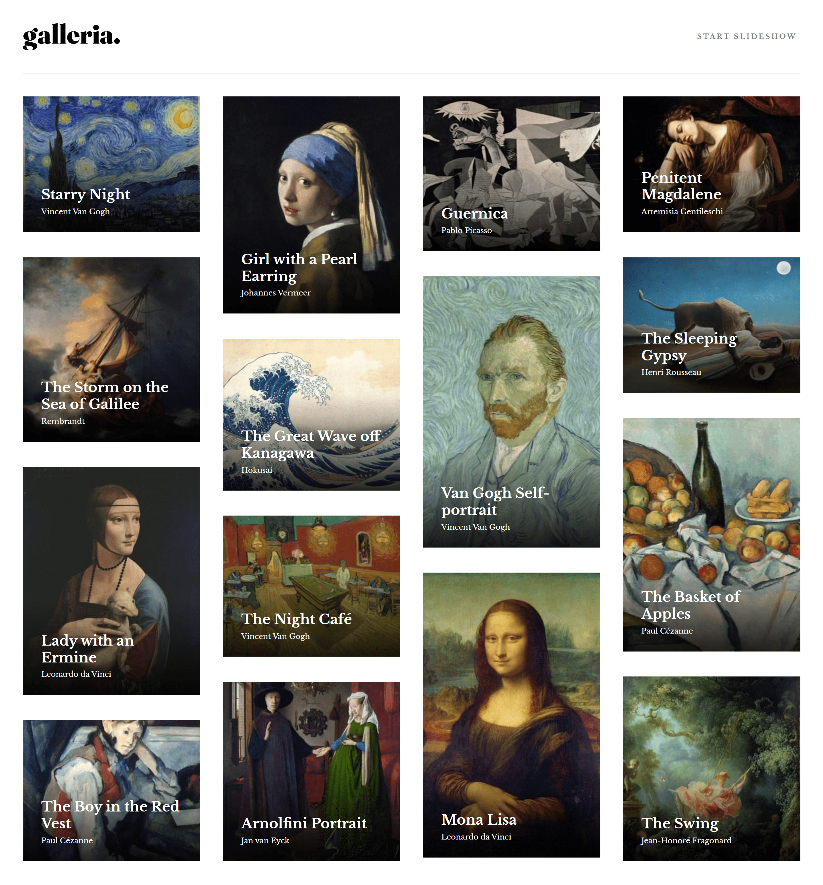

# Frontend Mentor - Galleria slideshow site solution

This is a solution to the [Galleria slideshow site challenge on Frontend Mentor](https://www.frontendmentor.io/challenges/galleria-slideshow-site-tEA4pwsa6). Frontend Mentor challenges help you improve your coding skills by building realistic projects.

## Table of contents

- [The challenge](#the-challenge)
- [Screenshot](#screenshot)
- [Links](#links)
- [Built with](#built-with)
- [Author](#author)

### The challenge

Users should be able to:

- View the optimal layout for the app depending on their device's screen size
- See hover states for all interactive elements on the page
- Navigate the slideshow and view each painting in a lightbox

### Screenshot

### Links

- Solution URL: (https://github.com/JradLouay/galleria-site)
- Live Site URL: (https://gorgeous-tiramisu-4ba9c2.netlify.app/)

### Built with

- [React](https://reactjs.org/) - JS library
- Vite

## Author

- Frontend Mentor - [@JradLouay](https://www.frontendmentor.io/profile/JradLouay)
